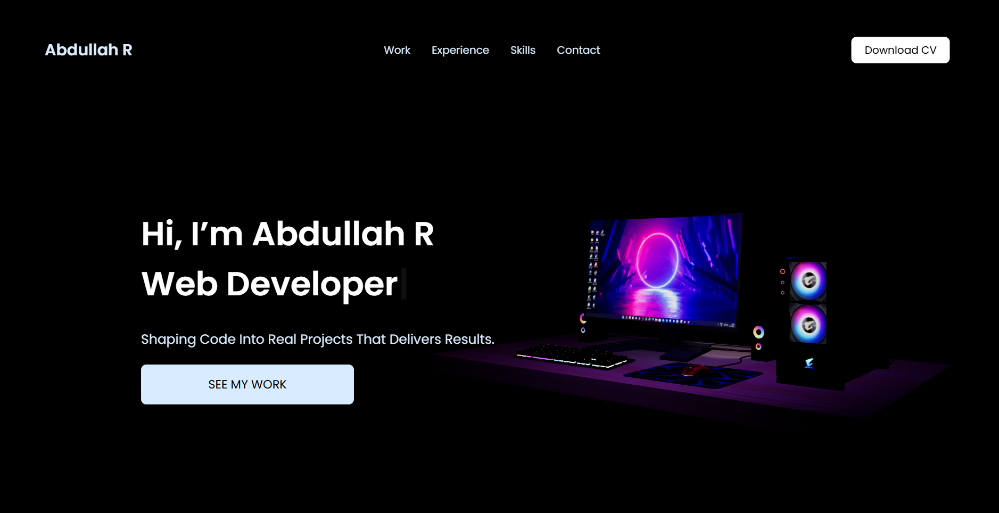

# 🚀 3D Developer Portfolio – Abdullah R

A visually striking **3D developer portfolio** built using modern web technologies like **React.js**, **Three.js**, and **Framer Motion**, designed to showcase my skills, projects, and passion for building immersive user experiences.

## 🌐 Live Demo
👉 [Visit My Portfolio](https://abdullahzaid.vercel.app)

## 🛠 Tech Stack

- **Frontend**: React.js, Three.js (`@react-three/fiber`), Tailwind CSS / Styled Components
- **Bundler**: Vite / Webpack
- **Deployment**: Vercel / Netlify

## 📸 Preview

   
    
   

